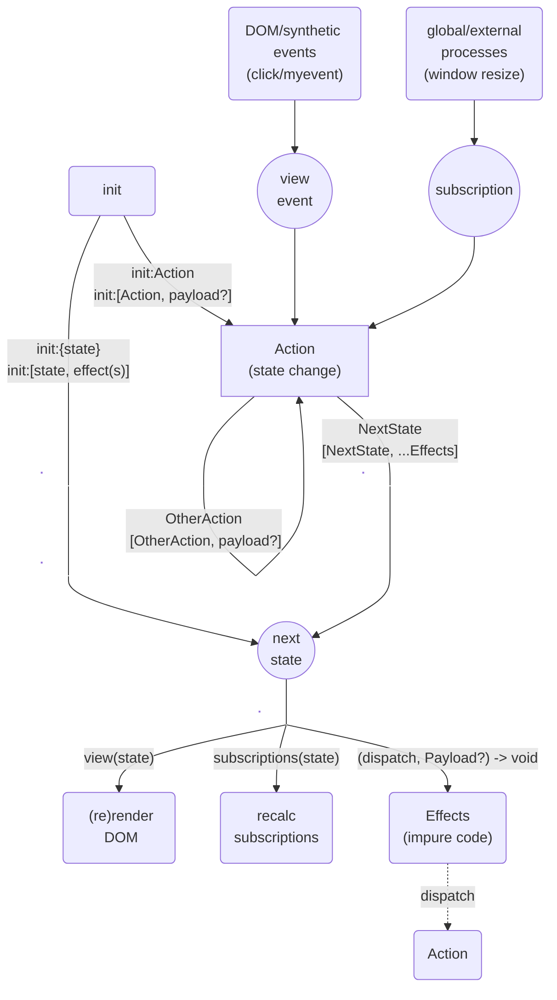
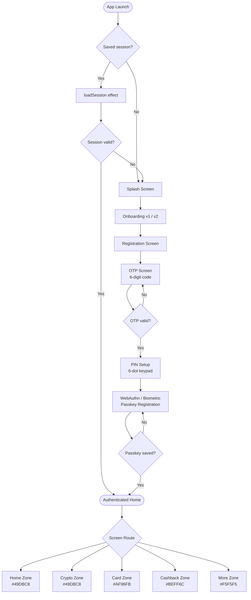
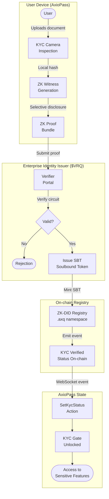
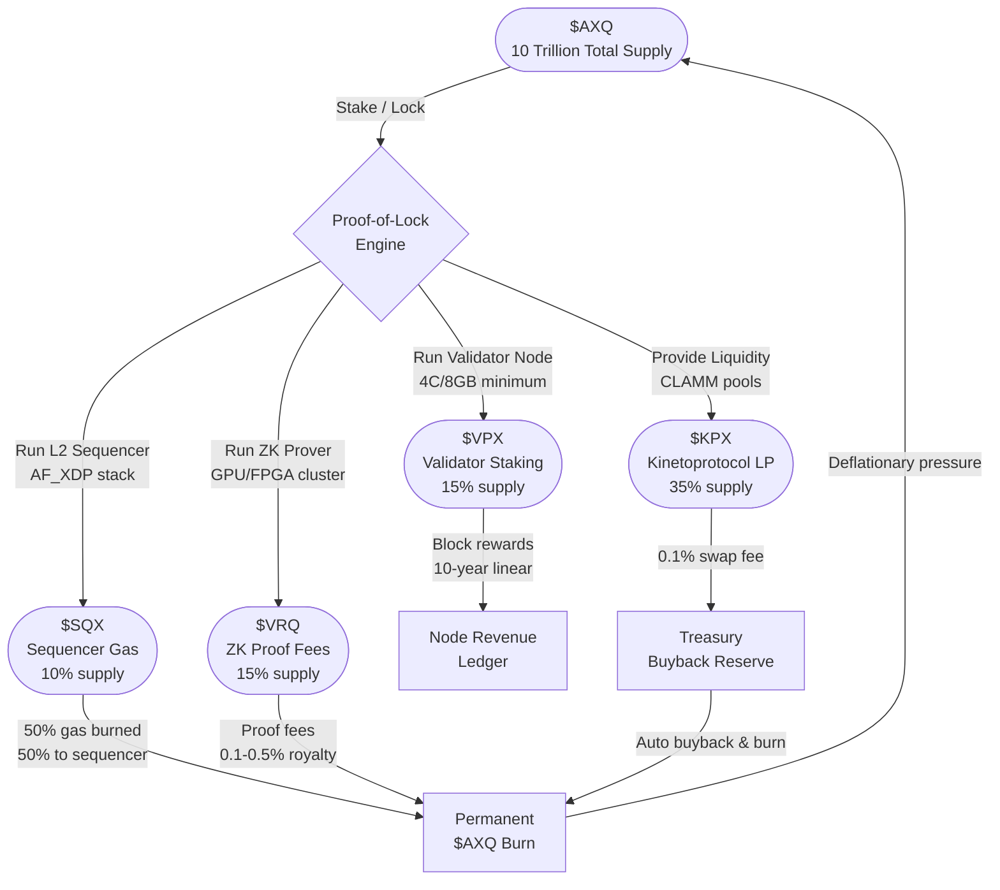
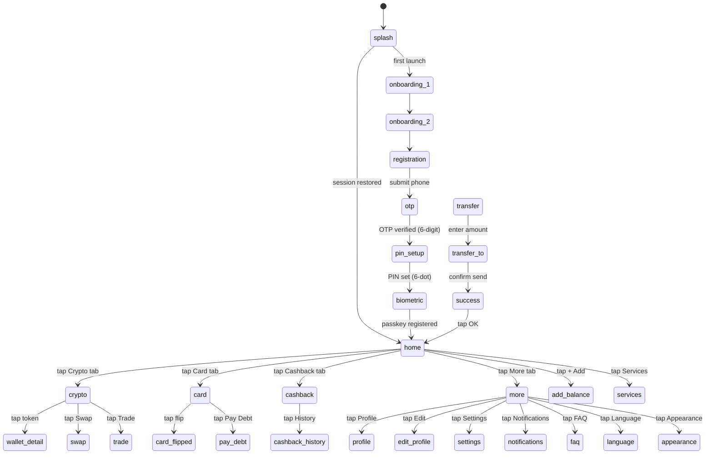

# Axioledger Architecture Flowcharts

---

## 1. Core axioledger Data Flow

The fundamental unidirectional data flow of the Axioledger DApp engine:



---

## 2. AxioPass Authentication Flow

The full user authentication lifecycle — from cold start to authenticated session:



---

## 3. Axioledger Cross-Chain Transaction Flow

A complete journey of a user-initiated cross-chain transfer from L2 (Sequentichain) to L1 (Axioledger mainnet):

```mermaid
flowchart LR
    subgraph AxioPass["AxioPass Wallet (UI)"]
        U([User]) -->|"1. Enter amount\n$AXQ string"| TX[TransferIntent\nAction]
        TX -->|"2. Build StatelessTx"| SIGN[Sign with Passkey\nWebAuthn P-256]
        SIGN -->|"3. Merkle Witness\nattached"| SUBMIT[broadcastStatelessTx\nEffect]
    end

    subgraph L2["L2 · Sequentichain ($SQX)"]
        SUBMIT -->|"4. Submit Tx"| SEQ[Sequencer\nAF_XDP Socket]
        SEQ -->|"5. Batch aggregate"| BATCH[Batch Aggregator]
        BATCH -->|"6. ZK-SNARK commit"| ZKC[ZK State\nCommitment]
    end

    subgraph ZKLayer["ZK Infrastructure · Veraciphers ($VRQ)"]
        ZKC -->|"7. Generate proof"| PROVER[Off-chain Prover\nGPU / FPGA]
        PROVER -->|"8. Proof submitted"| VERIFY[On-chain Verifier\nContract]
    end

    subgraph L1["L1 · Axioledger Mainnet ($AXQ)"]
        VERIFY -->|"9. Proof valid"| FINALISE[State Root\nAttestation]
        FINALISE -->|"10. Block committed"| LEDGER[(Merkle Patricia\nTrie)]
        LEDGER -->|"11. Event emitted"| RECEIPT[Tx Receipt\nIndexed]
    end

    subgraph Wallet["Wallet State Update"]
        RECEIPT -->|"12. WebSocket event"| WS[ReceiveL2Event\nSubscription]
        WS -->|"13. Dispatch"| UPDATE[UpdateBalance\nAction]
        UPDATE -->|"14. Re-render"| UI[Balance Display\nUpdated]
    end
```



---

## 4. ZK-KYC Identity Verification Flow

How AxioPass performs privacy-preserving KYC via ZK-DID and $VRQ:



---

## 5. Tokenomics Flow — 5-Token Proof-of-Lock System

How users lock $AXQ to mint and use utility sub-tokens:



---

## 6. AxioPass Screen State Machine (5-Zone Router)

The finite-state machine governing screen navigation in AxioPass:



---

## 7. DAO Dual-Chamber Governance Flow

How $AXQ holders and $VPX operators jointly govern Axioledger:

```mermaid
flowchart TD
    subgraph House["House of Holders — $AXQ Stakers"]
        H1([Proposal\nSubmitted]) --> H2[Community\nDiscussion]
        H2 --> H3{Quorum\nReached?}
        H3 -- No --> H2
        H3 -- Yes --> H4[House Vote\n$AXQ Weighted]
        H4 --> H5{Vote Passes\n>50%?}
        H5 -- No --> REJECT1([Rejected])
        H5 -- Yes --> CROSS[Cross-Chamber\nResolution]
    end

    subgraph Senate["Senate of Operators — $VPX Nodes"]
        CROSS --> S1[Senate Review\n$VPX Weighted]
        S1 --> S2{Senate Passes\n>67%?}
        S2 -- No --> VETO([Senate Veto])
        S2 -- Yes --> TIMELOCK[Timelock\nController\n48h delay]
    end

    subgraph Execution["On-chain Execution"]
        TIMELOCK --> EXEC{Emergency\nVeto Window?}
        EXEC -- Vetoed --> CANCEL([Cancelled])
        EXEC -- Passed --> UPGRADE[WASM Runtime\nPatch Applied]
        UPGRADE --> TELEMETRY[Node Version\nTelemetry]
    end

    subgraph Decay["Governance Decay Engine D(t)"]
        INACTIVE([Inactive Holder\nDetected]) --> DECAY[Apply D(t)\nDecay Function]
        DECAY --> HAIRCUT[Asset Haircut\n1%/3%/5% threshold]
        HAIRCUT --> SUPPRESS[Whale Voting\nSuppressed]
    end
```
